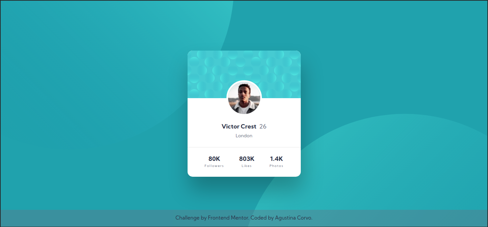

# Frontend Mentor - Profile card component solution

This is a solution to the [Profile card component challenge on Frontend Mentor](https://www.frontendmentor.io/challenges/profile-card-component-cfArpWshJ). Frontend Mentor challenges help you improve your coding skills by building realistic projects.

## Table of contents

- [Overview](#overview)
  - [The challenge](#the-challenge)
  - [Screenshot](#screenshot)
  - [Links](#links)
- [My process](#my-process)
  - [Built with](#built-with)
  - [Continued development](#continued-development)
  - [Useful resources](#useful-resources)
- [Author](#author)
- [Acknowledgments](#acknowledgments)

**Note: Delete this note and update the table of contents based on what sections you keep.**

## Overview

### The challenge

- Build out the project to the designs provided

### Screenshot

### Links

- [Solution URL](https://aguscorvo.github.io/profile-card-component/)

## My process

### Built with

- Semantic HTML5 markup
- CSS custom properties
- Flexbox
- Mobile-first workflow

### Continued development

I'd like to keep practicing the basics of HTML and CSS. On my next projects I'll add SASS as a CSS preprocessor and Grid Layout.

### Useful resources

- [Platzi](https://platzi.com)
- [freeCodeCamp](https://www.freecodecamp.org)
- [MDN Web Docs](https://developer.mozilla.org/en-US/docs/Web/CSS)

## Author

- Frontend Mentor - [@aguscorvo](https://www.frontendmentor.io/profile/aguscorvo)
- Twitter - [@agustina_corvo](https://twitter.com/agustina_corvo)

## Acknowledgments

Thanks [Irving](https://github.com/IrvingJuarez) for helping me to adjust the height of the top section of the card.

I've got some inspiration from [Sebastien Stordeur's solution](https://www.frontendmentor.io/solutions/profile-card-component-first-attempt-NzK22HFpx) to set correctly the background images.
